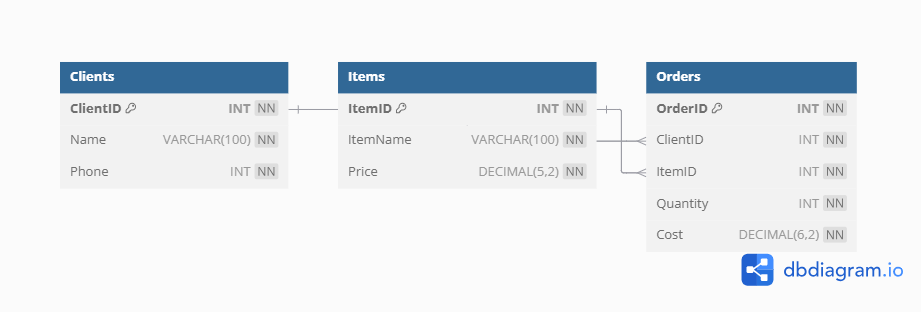

# Jewelry-Store-Database-Project
A MySQL-based relational database project designed to support the operations of Mangata and Gallo, a boutique jewelry company. The database handles client information, orders, and inventory of items.

---

## 📌 Project Overview

Mangata and Gallo is a jewelry store that specializes in occasions like engagements, weddings, and anniversaries. The store operates primarily online with a small physical presence in Austin, Texas. This project simulates a backend relational database system to manage its key business data.

---

## 🗂️ Features

- Relational schema with 3 tables: `Clients`, `Items`, and `Orders`
- Proper use of primary keys, foreign keys, and constraints
- Normalized schema (3NF)
- Sample business insights with SQL queries
- Clean ER Diagram for database structure

---

## 📁 Files

- `create_tables.sql`: Schema definitions with constraints
- `insert_data.sql`: Sample data entries for testing
- `sample_queries.sql`: Business insight queries (e.g., top clients, most ordered items)
- `jewelry_store_erd.png`: Entity-Relationship Diagram of the database

---

## 🧠 Sample Business Queries

- Identify top clients by total spend
- Determine the most popular items
- Summarize order values and quantities

---

## 🖼 ER Diagram

---

## 🛠 Tools Used

- MySQL
- VS Code
- Git & GitHub
- [dbdiagram.io](https://dbdiagram.io)

---

## 📬 Contact

For questions or collaboration, feel free to connect with me on [LinkedIn](www.linkedin.com/in/toluwanimi-oke-16763b228).
